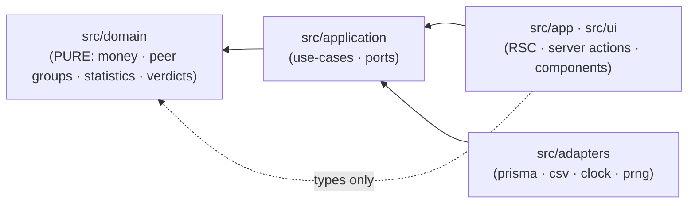
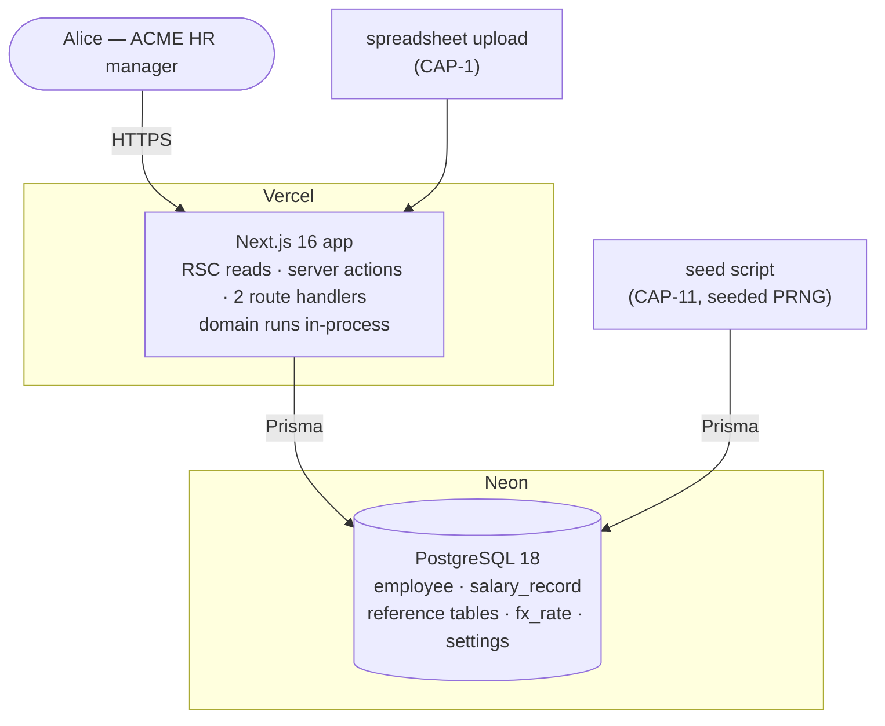
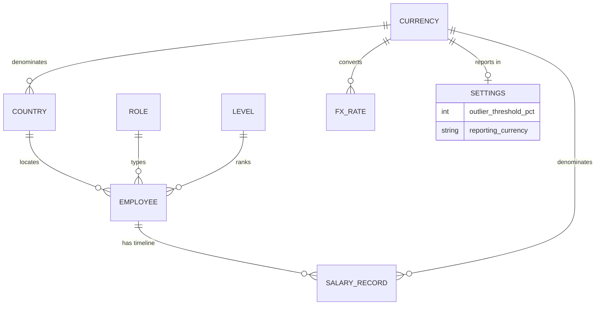

# Architecture Spine — Salary Management for ACME HR

## Design Paradigm

**Functional core, imperative shell** (hexagonal-lite).

The SPEC already demands what this paradigm supplies for free: every answer is a pure function of `(data, as-of date, threshold)`, and core logic must be unit-tested fast and deterministically with no wall clock. The fairness math is a pure module with no I/O, no clock, and no randomness; everything that touches the world — Postgres, HTTP, React, the filesystem, the clock, the PRNG — is an adapter in the shell.

| Layer | Namespace | May depend on |
| --- | --- | --- |
| Domain (functional core) | `src/domain/` | nothing outside itself |
| Application (use-cases, ports) | `src/application/` | `domain` |
| Adapters (imperative shell) | `src/adapters/` | `application`, `domain` |
| UI / delivery | `src/app/`, `src/ui/` | `application`, `domain` (types only) |

## Invariants & Rules



### AD-1 — Dependencies point inward, mechanically enforced

- **Binds:** all
- **Prevents:** a component importing `PrismaClient` or calling `new Date()` directly — impure, untestable, and still compiling.
- **Rule:** `src/domain/**` imports nothing outside `src/domain/**`; specifically no Prisma, no Next, no `Date`, no `Math.random`, no `fs`. Adapters reach the domain only through ports declared in `src/application/ports/`. Enforced in CI by an import-boundary lint rule, which must exist before the second feature merges. CI runs lint, typecheck, and unit tests on every push; a failing gate blocks merge.

### AD-2 — SQL never computes a domain statistic

- **Binds:** CAP-5, CAP-6, CAP-7, CAP-8, CAP-9, CAP-10
- **Prevents:** Postgres `percentile_cont` interpolating continuously while a hand-written TypeScript median picks discretely — two units answering the same CAP-5 question with different medians, both looking correct.
- **Rule:** the database stores rows and selects sets. It computes no median, spread, distance, gap, count, or total that reaches a user as a domain value. Every statistic is computed in-process by `src/domain/`. No `percentile_cont`, no `AVG`, no domain-value window functions. `COUNT`, `ORDER BY`, and `LIMIT` used purely for directory listing and pagination are not domain values and are permitted; any `n` a user sees is the cardinality of the exact in-memory set the statistic was computed over (AD-16), never a separate `COUNT` query.

### AD-3 — One canonical median

- **Binds:** CAP-5, CAP-6, CAP-7
- **Prevents:** lower-median vs upper-median vs interpolated-median forking between the peer-comparison card, the outlier sweep, and the gender-gap view — three consumers of one number.
- **Rule:** sort ascending by integer minor units. Odd `n` → the middle element. Even `n` → the arithmetic mean of the two middle elements, rounded half-up to the nearest minor unit. Exactly one implementation exists, in `src/domain/statistics.ts`; no other median may be written. A median of an empty set is not defined and is never computed — see AD-16.

### AD-4 — Money is integer minor units plus a currency code

- **Binds:** CAP-1..CAP-10
- **Prevents:** float drift making medians and distance percentages irreproducible, breaking the boundary exactness CAP-6 requires; and a unit assuming two decimals everywhere, mis-rendering JPY.
- **Rule:** every monetary value is `{ amountMinor: bigint, currency: string }`. No `number`, no float, no bare amount crosses any boundary — including CSV columns and React props. The minor-unit exponent comes from the currency reference table, never a hard-coded 100. At any JSON or Server Action boundary, `amountMinor` serializes as a **decimal string**, never a JS number and never a raw `bigint`. A salary is strictly positive: `salary_record.amount_minor > 0` is a database `CHECK` and a write-time validation, which is what makes a median of a non-empty group non-zero and AD-5's division safe.

### AD-5 — Distance is signed for display, absolute for judgement

- **Binds:** CAP-5, CAP-6
- **Prevents:** three divergences at once — (a) an implementer reading the rule literally and testing a signed `−25.2 > 20`, so **underpaid employees never flag**, silently deleting half of CAP-6 and half of CAP-11's planted outliers; (b) a badge reading `20.0% above median` on a row that *is* flagged because the unrounded value was 20.04; (c) the boundary at exactly 20.0, which the SPEC leaves undefined (it fixes 19.9 → no, 20.1 → yes, and is silent between).
- **Rule:** distance is expressed in **percentage points**: `d = (salary − median) / median × 100`. The arithmetic is exact — rational or decimal over the integer minor units, never IEEE double, because in a double `20.05` is `20.049999…` and would never round up to flag. Round the **magnitude** half-up to exactly one decimal place, then reapply the sign — so `+20.05 → +20.1` and `−20.05 → −20.1` round symmetrically. The sign is carried into display and into the badge's direction word. The outlier flag tests `|d| > threshold`, strictly; `|d| = 20.0` does not flag. The number shown is the number judged. The median is never zero (AD-4) and the group is never empty (AD-16), so the division is total.

### AD-6 — Currency lives on the salary record

- **Binds:** CAP-2, CAP-3, CAP-4, CAP-9 · settles EXPERIENCE.md Note 2
- **Prevents:** resolving currency from `employee.country` at read time, retroactively rewriting the currency of immutable historical records if an employee's country ever changed — and, via the country clause below, a mixed-currency peer group, which is the SPEC's "no comparison crosses a currency" failing *by discipline* where it promises to hold *structurally*.
- **Rule:** `salary_record.currency_code` is written from the employee's country via the country reference table at write time, and validated to equal it. This holds on **every** write path without exception — the record-change form, CAP-1 import, and the CAP-11 seed — enforced in the repository's `append`, which is the single funnel all three pass through. Reads never re-resolve it. The record-change form's currency field (EXPERIENCE.md mandates three fields) is **pre-filled from the employee's country and validated on submit**; a mismatch is rejected, not saved. It is a confirmation, not a free choice. **`employee.country` is set at create and is immutable**: no form, use-case, or repository method offers a country update, and the employee form renders country as editable only on create. An employee whose country changed would leave their old-currency history inside their new country's peer group; until a mobility capability decides how history re-currencies, the field does not move. This narrows CAP-2 — see Deferred.

### AD-7 — Import validates country like role and level, and only ever creates

- **Binds:** CAP-1, CAP-11 · settles EXPERIENCE.md Note 4
- **Prevents:** an unknown country silently creating a peer group of one *and* a salary with no resolvable currency — breaking the `n ≥ 5` refusal semantics and currency isolation together. Also prevents the re-import in EXPERIENCE.md Flow 4 forking: one unit upserting on name (which AD-10 says is not identity) while another creates duplicates.
- **Rule:** a row whose role, level, or country is absent from the reference table is rejected per-row with its reason. No row is mapped or guessed into a taxonomy value. Remaining valid rows still import. Every import row carries an explicit `effective_from` for the salary it lands; a row without one is rejected rather than defaulted to today or to the hire date. **Import is create-only — never an upsert, never a merge.** Every valid row creates a new employee; the file carries no identity, so re-importing a row already imported creates a second person. Flow 4's correction path is to re-import *only* the corrected rows, which the per-row report makes obvious. The accepted format is **CSV**; an `.xlsx` upload is refused as a whole file with one statement of what could not be read. The seed (CAP-11) passes the same validation — it is a client of the same use-case, never a privileged write path.

### AD-8 — Same-date tie-break is insertion sequence

- **Binds:** CAP-3, CAP-4, CAP-5, CAP-6, CAP-7, CAP-9, CAP-10 — every capability that reads a current salary · settles EXPERIENCE.md Note 5
- **Prevents:** two records sharing an `effective_from` resolving differently between queries. AD-18 makes same-day appending the *only* correction mechanism, so ties are the designed path, not an edge case: a loader using `ORDER BY effective_from DESC` and one using `(effective_from, seq)` would give the same employee a different median, distance, and outlier flag than their own CAP-4 timeline shows.
- **Rule:** `salary_record.seq` is a monotonically increasing `BIGSERIAL`. Current salary = the record with the greatest `(effective_from, seq)` where `effective_from ≤ as-of date`. `created_at` may not be used as a tie-break. There is exactly one current-salary resolver, in `src/domain/`; every capability above consumes it rather than writing its own `ORDER BY`.

### AD-9 — Spread is min–max

- **Binds:** CAP-5, CAP-7 (spread renders on the gender-gap surface too) · settles EXPERIENCE.md Note 1
- **Prevents:** the stored measure and the displayed measure forking — UX shows a min–max range; an IQR-based "spread" underneath would make the caption a lie.
- **Rule:** spread is the minimum and maximum of the peer group's as-of current salaries, in the group's single currency. Not IQR, not standard deviation, not percentile rank.

### AD-10 — Employee identity is an opaque surrogate

- **Binds:** CAP-1, CAP-2, CAP-3, CAP-4, CAP-5, CAP-11 · settles EXPERIENCE.md Note 3
- **Prevents:** name-as-key collisions across 10,000 people, and URLs breaking when a name is corrected.
- **Rule:** `employee.id` is a UUIDv7, generated in the shell via an id port, never derived from name. Names are searchable, never identifying. **The seed's id port derives every UUIDv7 from the seeded PRNG and a fixed epoch, not the wall clock** — a seed run is byte-identical across runs (AD-14).

### AD-11 — The as-of date is a parameter, never a reading

- **Binds:** all
- **Prevents:** a unit defaulting the as-of date internally, so the same question answers differently tomorrow and its tests depend on the wall clock.
- **Rule:** every domain and application function takes the as-of date as a required explicit argument. No code under `src/domain/**` **or** `src/application/**` calls `Date.now()`, `new Date()`, or reads a timezone — the clock port is the only source of "now" in the system, and only adapters may implement it. It supplies "today" as a *default* at the delivery boundary and as the input to AD-18's write-time check. "Today" is the current date in **UTC**; no other timezone exists in this system.

### AD-12 — Findings are computed, never stored

- **Binds:** CAP-6
- **Prevents:** a materialized outlier table going stale against a changed salary, and seen/unseen state drifting from EXPERIENCE.md's contract that the findings list is a pure function of data + threshold + as-of date.
- **Rule:** the sweep loads the as-of population (AD-16) and computes findings in-process per request. No materialized outlier table, no cache, no dismissal or acknowledgement state.

### AD-13 — FX rates are pinned rows, resolved by the as-of date

- **Binds:** CAP-9
- **Prevents:** a converted figure reaching the screen without its receipts, org-wide totals moving under a wound-back as-of date, and two units summing in different orders to different answers.
- **Rule:** rates live in `fx_rate (from_currency, to_currency, rate NUMERIC, pinned_on DATE)`. A **rate set** is all rows sharing one `pinned_on` — that column is the set's identity, and a set is written whole or not at all. A conversion uses the set with the greatest `pinned_on ≤ as-of date`; if no such set exists, or it lacks a pair the total needs, the org-wide total **refuses** rather than converting. The org-wide target currency is `settings.reporting_currency`; there is exactly one, and it is never inferred from the data. **Per-country totals never convert** (CAP-9). The org-wide total is computed as: sum each country's salaries in its own currency → convert each country total once → sum the converted totals. Never per-employee conversion. Rate arithmetic is decimal, never float; the result rounds half-up to the target currency's minor unit at the final step only. The resolved rate and its `pinned_on` travel in the domain payload (AD-20), not the caption.

### AD-14 — Randomness is injected and seeded

- **Binds:** CAP-11
- **Prevents:** an irreproducible population, failing CAP-11's "fixed seed, reproducibly" criterion and making the planted outliers, thin cells, and gender effects unverifiable.
- **Rule:** the seed generator draws from a seeded PRNG passed in as a port; `Math.random` is banned repo-wide by lint. Log-normal draws use Box–Muller over the seeded stream. The generated population's five structural obligations (comparable groups, thin groups, planted outliers, within-group gender gaps with ≥5 of each gender, gender clustering across levels) are **asserted by tests**, not left to the draw — a seed that fails to plant them fails CI.

### AD-15 — Design tokens are generated from DESIGN.md, not copied

- **Binds:** all UI surfaces
- **Prevents:** the DESIGN.md token contract and the stylesheet drifting — one component hand-copying a hex from a Stitch mock while another reads the spec, with the mocks explicitly losing on conflict.
- **Rule:** the Tailwind theme is generated from `DESIGN.md`'s frontmatter by a build step, emitting both the light and `*-dark` sets as one paired theme. No hex literal appears in application code; shadcn/ui components are re-pointed at generated tokens on copy-in. DESIGN.md remains the single source of visual truth.

### AD-16 — The as-of population defines every peer group

- **Binds:** CAP-5, CAP-6, CAP-7, CAP-8, CAP-10
- **Prevents:** the sharpest hole in this spine — CAP-5's card and CAP-6's sweep selecting *different sets* for the same group and simultaneously answering and refusing it. Without this, one unit counts every employee matching the triple (n=6, answers) while another counts only those with a salary as of the date (n=4, refuses), and the card prints "Based on 6 peers" over a median of 4 — the exact failure the `n ≥ 5` refusal exists to prevent.
- **Rule:** an employee is **in the as-of population** at date `D` iff `hire_date ≤ D` **and** at least one salary record has `effective_from ≤ D`. The peer group of employee `E` at `D` is every employee in the as-of population sharing `E`'s `(role, level, country)`, **including `E`**. `n` is the cardinality of that exact set and is counted identically by every capability. Employees outside the population appear in no peer group, in no `n`, in no total, and in **no headcount a user sees** — every figure on every surface, including Home's headcount and CAP-8's gender counts, is a count of the as-of population, never of the table. An employee not in the population yields a distinct refusal (`no salary as of D`), never `n = 0` arithmetic. An employee may exist with zero salary records — CAP-2 creates one — and is invisible to all statistics until a record exists.
- **Rule (`n ≥ 5`):** the refusal threshold is a property of the population, not of any one view. A peer group with `n < 5` refuses every comparison over it — CAP-5's card, CAP-6's finding row, and CAP-7's gap alike — naming `n`. It is never widened (SPEC constraint). CAP-7 additionally requires `≥ 5` of each gender (AD-17).

### AD-17 — The gender gap has one formula

- **Binds:** CAP-7
- **Prevents:** five defensible readings — `(m−f)/m`, `(m−f)/f`, `(f−m)/f`, an absolute money difference, or an unsigned magnitude — yielding "8%", "−8.7%", or "₹2,00,000" from identical data, in the sentence Alice pastes into Slack.
- **Rule:** within one peer group, over its as-of population (AD-16): compute the male median `M` and female median `F`, each per AD-3. `gap = (M − F) / M × 100`, in percentage points, in exact decimal arithmetic, magnitude rounded half-up to **exactly one decimal place** then sign reapplied — the same rule AD-5 states, applied here to CAP-7. **The denominator is always the male median.** Positive means men are paid more. Reported only when both genders have `n ≥ 5` in that group; otherwise refuse, naming both counts and which gender is short.

### AD-18 — Append-only is enforced, not promised

- **Binds:** CAP-1, CAP-2, CAP-3, CAP-4, CAP-11
- **Prevents:** the SPEC's loudest constraint ("no salary is ever overwritten") holding only by discipline — `salaryRecord.update()` would compile and pass every test. Purity, determinism, and randomness each got a mechanical gate; this needs one too.
- **Rule:** `salary_record` has no update and no delete path. The application database role has `UPDATE` and `DELETE` **revoked** on that table by migration, and the repository port exposes only `append` and read methods. Write-time validation rejects `effective_from > today` (no future-dating, no scheduled changes) on **every** write path — form, import, and seed — with `today` the UTC date supplied by the clock port and passed explicitly (AD-11). Appending a new record dated today is the only correction mechanism.

### AD-19 — The threshold is a parameter, like the as-of date

- **Binds:** CAP-6
- **Prevents:** an ambient mutable setting read deep inside the math, making "the same question asked twice returns the same answer" false across a settings change and forcing tests to mutate global state.
- **Rule:** the threshold is a required explicit argument to every outlier function. The `settings` table holds the current default; it is read once at the delivery boundary and passed inward. No domain code reads settings.

### AD-20 — Answers cross the boundary carrying their receipts

- **Binds:** CAP-5, CAP-6, CAP-7, CAP-9
- **Prevents:** the number and its provenance being assembled separately — a caption composed in a React component drifting from the figure it sits under, and copy-answer's sentence drifting from the card's. EXPERIENCE.md requires both to be the same sentence with the same receipts.
- **Rule:** every computed answer leaves the application layer as a discriminated union — `{ kind: 'answer', … } | { kind: 'refusal', reason, counts }` — carrying its value **and** its provenance in one object: group definition, `n`, as-of date, currency, the threshold it was judged against where one applies (AD-19), and every rate used with its `pinned_on` where converted (AD-13). The verdict sentence is composed by exactly one function in `src/domain/verdict.ts` and consumed unmodified by both the card and copy-answer. A refusal is a return value, never an exception, and carries its counts.

### AD-21 — One delivery boundary per job

- **Binds:** all surfaces
- **Prevents:** Import, record-change, Settings Apply, and three CSV exports each independently choosing between RSC direct-call, Route Handler, and Server Action — six surfaces, six conventions, and an accidental fetch-to-self.
- **Rule:** **Reads** — React Server Components call use-cases directly in-process; never `fetch` to our own origin. **Mutations** — Server Actions. **Route Handlers** — only where a non-RSC transport genuinely requires one, and this wins over the Server Action rule where both could apply: the CAP-1 multipart spreadsheet upload and CSV export downloads. Exactly two routes exist; nothing else gets one.

### AD-22 — Overdue is measured from the as-of date

- **Binds:** CAP-10
- **Prevents:** the determinism promise leaking at its last unguarded edge — one unit measuring "no change in 2 years" back from the wall clock while another measures back from the as-of date, so winding the date back does *not* reproduce yesterday's overdue list. It also settles the hire-only employee, where a criterion-reader and an intent-reader differ by hundreds of people.
- **Rule:** the cutoff is `asOf − period`, derived from the as-of date and never from the clock. An employee in the as-of population (AD-16) is overdue iff the `effective_from` of their as-of current record (AD-8) is **strictly earlier** than the cutoff; a record dated exactly on the cutoff is not overdue. **A hire record is a salary record**: someone hired long ago and never adjusted *is* overdue, which is the finding CAP-10 exists to surface. The preset chips and the custom date resolve to the same cutoff by the same rule — a chip is a period, not a second code path. Period arithmetic is calendar-based, and a day that does not exist in the target month clamps to that month's last day (29 Feb minus one year is 28 Feb). Home's overdue card names the as-of date rather than saying "currently" — EXPERIENCE.md's "41 people are currently overdue" is superseded on this point.

## Consistency Conventions

| Concern | Convention |
| --- | --- |
| Naming | Domain uses the SPEC's vocabulary verbatim — `peerGroup`, `peerMedian`, `distancePct`, `outlier`, `threshold`, `refusal`, `salaryTimeline`, `effectiveFrom`, `asOf`, `overdue`. Banned in code as in copy: `snapshot`, `compaRatio`, `payBand`. DB tables `snake_case` singular; TS files `kebab-case`; types `PascalCase`. |
| Dates | `effective_from`, `pinned_on`, `hire_date` are calendar dates (`DATE`), never timestamps — no timezone, no instant. The as-of date is a plain-date value object, not a JS `Date`. |
| Money | Always `{ amountMinor, currency }` (AD-4). Rendered only through one formatter that requires both; a formatter call without a currency does not typecheck. Locale grouping (including Indian lakh/crore) is the formatter's job, driven by the currency reference table. |
| Errors | Domain functions are total — they do not throw. Adapters throw; the shell maps to HTTP. Import rejections and refusals are data, never exceptions. |
| Gender | `MALE` / `FEMALE` enum only; never part of peer identity (SPEC constraint), only sliced within one. |
| Config | Threshold is persisted data (single-row `settings`), not env (AD-19). Env holds only connection strings and the deploy target. |
| Accessibility | WCAG 2.2 AA is the floor on every surface (EXPERIENCE.md § Accessibility Floor, DESIGN.md § Contrast floor), gated in CI by an automated axe pass alongside lint and typecheck. Architecturally: recompute announcements ride a single app-level `aria-live=polite` region that is **not** remounted by an as-of or threshold change; refusal payloads (AD-20) render as a region with a heading, never `role="alert"`; skeleton states belong to the surface's own Suspense boundary, and a recompute must not re-suspend it. Automated gates do not discharge the manual keyboard and screen-reader checks the floor names. |

## Stack

| Name | Version |
| --- | --- |
| Node.js | 24 LTS *(Active LTS until 2026-10-20, when 26 promotes)* |
| TypeScript | 5.9.x *(see Deferred: TypeScript 7)* |
| Next.js (App Router) | 16.2.10 |
| React | 19.2.7 |
| PostgreSQL (Neon serverless) | 18 |
| Prisma ORM | 7.8.0 |
| Tailwind CSS | 4.3.2 |
| shadcn/ui | pinned by CLI revision at copy-in; recorded in `components.json` |
| Vitest | 4.1.10 |
| Playwright | 1.5x *[ASSUMPTION — not required by SPEC]* |

## Structural Seed

### Containers



### Core entities



`EMPLOYEE ||--o{ SALARY_RECORD` is zero-or-more, not one-or-more: CAP-2 creates an employee with no salary, and AD-16 makes that employee invisible to every statistic until a record exists.

A peer group is not a table. It is `(role, level, country)` derived at read time — the SPEC says nothing else defines one, and materializing it would create a second place for peer identity to drift from AD-2's math.

### Source tree

```text
payroll/
  src/
    domain/          # PURE. no I/O, no clock, no random (AD-1)
    application/
      ports/         #   repository, clock, prng, id interfaces
      use-cases/     #   one per capability
    adapters/
      db/            #   prisma client + repositories
      csv/           #   import parse, export render
      clock.ts       #   the only Date.now() in the codebase
      prng.ts        #   AD-14
    app/             # Next.js App Router surfaces (EXPERIENCE.md IA)
    ui/              # components; tokens generated from DESIGN.md (AD-15)
  prisma/
    schema.prisma
    migrations/
    seed.ts          # CAP-11
  tests/             # domain unit tests + seed obligation tests (AD-14)
```

Module filenames inside `src/domain/` are the code's to own; the Capability map below names areas, not files.

### Deployment & environments

| Environment | Host | Database | Migrations | Seed |
| --- | --- | --- | --- | --- |
| Local | `next dev` | Neon branch or local Postgres 18 | `prisma migrate dev` | explicit `npm run seed` |
| Preview | Vercel preview | Neon branch per PR | `prisma migrate deploy` (build) | manual |
| Production | Vercel | Neon primary | `prisma migrate deploy` (build) | one-time, explicit |

Postgres major is pinned to 18 across all three — a Neon branch inherits its parent's major, and local must match. No staging tier: one user, no real data, no auth (SPEC non-goal). Seeding is never automatic — a command, never a deploy side effect.

## Capability → Architecture Map

| Capability | Lives in | Governed by |
| --- | --- | --- |
| CAP-1 Bulk import | `adapters/csv` + `use-cases/import` | AD-4, AD-6, AD-7, AD-18, AD-21 |
| CAP-2 Employee CRUD | `use-cases/employee` | AD-6, AD-10, AD-16, AD-18, AD-21 |
| CAP-3 Record salary change | `domain` timeline + `use-cases/record-change` | AD-4, AD-6, AD-8, AD-11, AD-18 |
| CAP-4 Salary timeline | `domain` timeline | AD-8, AD-11, AD-18 |
| CAP-5 Peer comparison / refusal | `domain` statistics + peer group | AD-2, AD-3, AD-5, AD-8, AD-9, AD-16, AD-20 |
| CAP-6 Outliers + threshold | `domain` outliers | AD-2, AD-3, AD-5, AD-8, AD-12, AD-16, AD-19, AD-20 |
| CAP-7 Gender gap / refusal | `domain` gender gap | AD-2, AD-3, AD-8, AD-9, AD-16, AD-17, AD-20 |
| CAP-8 Gender by level | `domain` gender gap | AD-2, AD-16 |
| CAP-9 Payroll totals | `domain` totals | AD-4, AD-8, AD-13, AD-16, AD-20 |
| CAP-10 Overdue for review | `domain` overdue | AD-8, AD-11, AD-16, AD-22 |
| CAP-11 Seed 10,000 | `prisma/seed.ts` | AD-4, AD-6, AD-7, AD-10, AD-14, AD-18, addendum parameters |

## Deferred

- **TypeScript 7** — 7.0.2 went stable 2026-07-08 (native Go compiler, ~10× builds). Nine days old at authoring; 5.9.x pinned on the boring-technology principle, confirmed by rk. Revisit once Next.js 16 documents a 7.x baseline, or after TS 7.1 (~Oct 2026) closes the programmatic-API gaps.
- **Authentication and permissions** — SPEC non-goal, but the *only* item here that must flip before this touches a real salary record. Deferred, not dismissed. Revisit: the moment the HR *team* (not the manager alone) is a user.
- **Employee country change** — **a recorded deviation from CAP-2, not a clean deferral.** CAP-2 says an edited employee persists with country among its fields; this spine narrows that: country is set at create and is not editable in v1, because an edit would break AD-6's write-time currency invariant on records already written and silently move the employee between peer groups. The prohibition itself is binding in AD-6, not here. Confirmed by rk 2026-07-17. Revisit when a mobility capability appears; it must then decide whether history keeps its old currency (it should) and whether peer identity moves.
- **Caching / read models** — AD-12 says compute fresh. Revisit only if a sweep is measurably slow well past 10,000 headcount; the port boundary makes it a local change.
- **Pagination strategy for the 10,000-row directory** — EXPERIENCE.md bans infinite scroll and mandates pagination; page size and cursor-vs-offset is a story-level call, not a divergence risk (AD-2 permits the `COUNT`).
- **CSV export column layouts** — EXPERIENCE.md requires only that currency and as-of columns are present; AD-4, AD-13, and AD-20 already constrain the cells.
- **Observability, rate limiting, backup/restore** — no operational stakes at one user with a population regenerable from one command. Revisit if this ever holds data that isn't reproducible.
