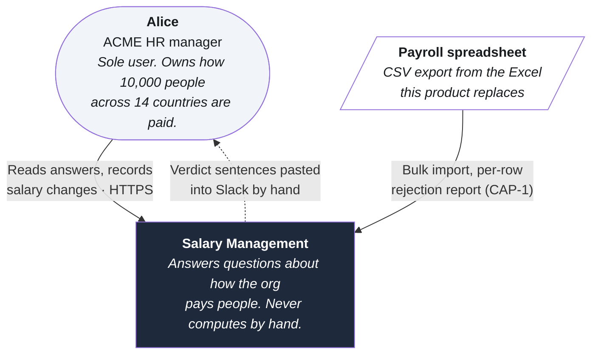
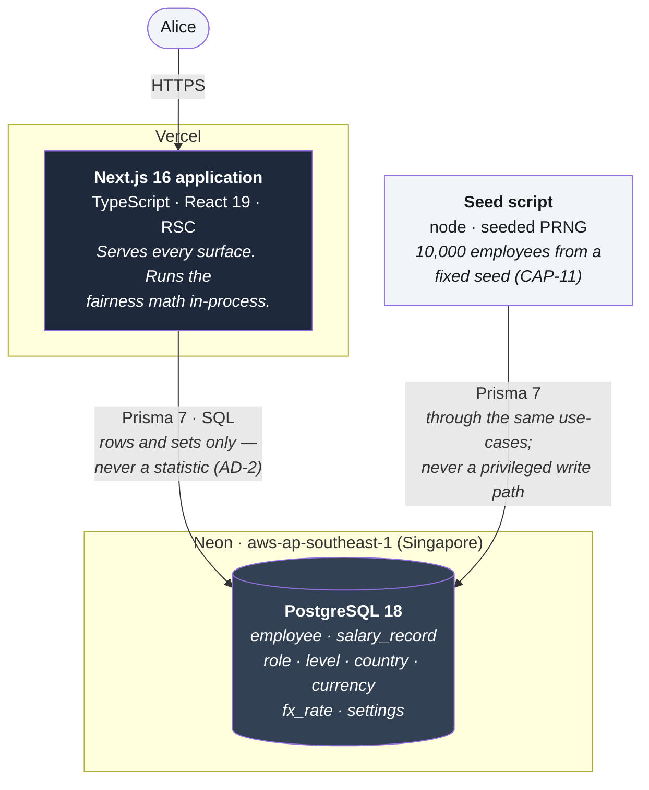
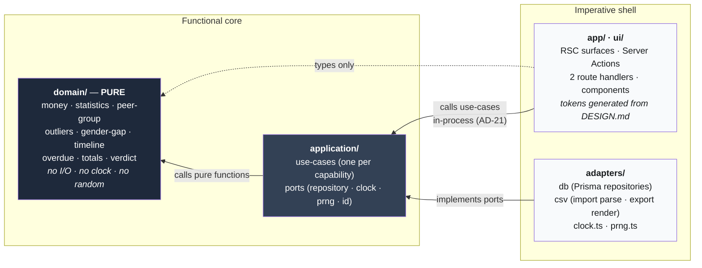
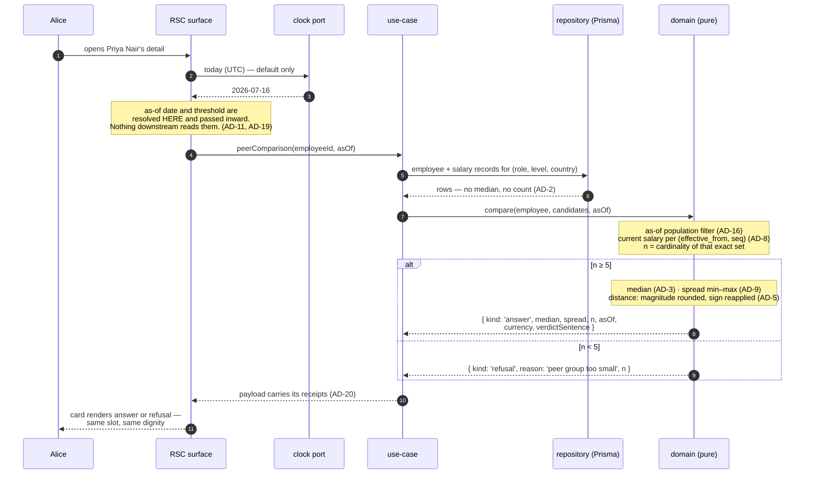
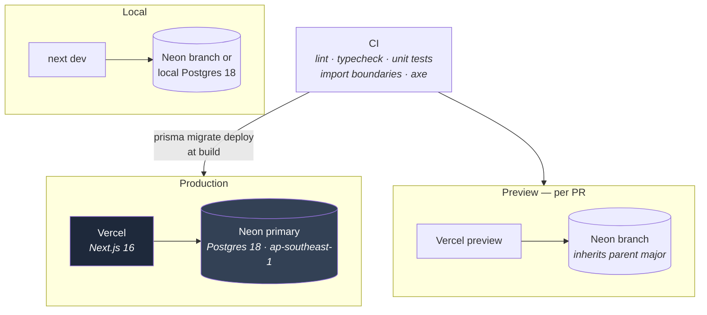

# C4 Model

Four zoom levels over the system the [spine](./ARCHITECTURE-SPINE.md) governs. The spine is the contract; these are views of it. On any conflict the spine wins.

---

## Level 1 — System context

One user, one system, no integrations. That emptiness is a finding rather than an omission: this product exists to replace a spreadsheet, and it deliberately connects to nothing. No payroll execution (money never moves), no HRIS sync, no market benchmark feed, no notification channel — the product never reaches out, and findings wait for Alice to arrive.

The dotted line is the product's success criterion, and it is a human path on purpose: Alice copies a sentence and pastes it herself. There is no integration to build, because standing behind the number is the point.

---

## Level 2 — Containers

Three containers, and the count is itself a decision. A separate API tier was rejected: two deployables, CORS, duplicated types, and a network hop, for a single-user tool over 10,000 rows.

The seed is drawn as a container rather than a script because it writes production-shaped data through the same validation as the import — AD-6, AD-7, and AD-18 bind it exactly as they bind a form submission.

---

## Level 3 — Components inside the Next.js application

This is the level the paradigm lives at. Everything is arranged around one rule: **dependencies point inward, and the core is pure** (AD-1).

Read the arrows: nothing points *out* of `domain/`. That is enforced by an import-boundary lint rule in CI rather than by convention, because the failure it prevents — a component importing `PrismaClient`, or a use-case calling `new Date()` — compiles cleanly and passes review.

`clock.ts` is worth naming individually. It is the only `Date.now()` in the codebase. Everything else receives the as-of date as a required argument (AD-11), which is what makes "the same question asked twice returns the same answer" a structural property rather than a good intention.

---

## Level 4 — How one answer is computed

The peer-comparison card (CAP-5), traced end to end. Every other computed surface follows the same path.

Three properties fall out of this shape, and each maps to a promise the product makes to Alice.

**The refusal is a return value, not an exception.** It travels the same path as an answer and lands in the same layout slot. EXPERIENCE.md's wager is that honest refusal is the trust-building moment; an exception would route it to an error style and break the wager at the architecture level.

**The receipts cannot be separated from the number.** The payload carries the group definition, `n`, the as-of date, the currency, and the verdict sentence as one object (AD-20). A caption composed independently in a React component could drift from the figure above it; this one cannot. It is also why copy-answer and the card are guaranteed to say the same thing — one function composes the sentence, and both consume it unmodified.

**Nothing below the boundary can read a clock.** The as-of date enters once, at the top, as a default. Wind it back and every figure recomputes to what it was — not approximately, exactly.

---

## Deployment

Postgres major is pinned to 18 in all three environments — a Neon branch inherits its parent's major, and local must match, or a query behaves differently in the one place nobody looks. Region is `aws-ap-southeast-1` (Singapore) — Neon has no India region; synthetic data (AD-14) imposes no residency constraint, so Singapore (nearest region) is used.

No staging tier: one user, no real data, no auth (a SPEC non-goal, and the one deferral that must flip before this touches a real salary record). **Seeding is never a deploy side effect** — it is an explicit command, always.
