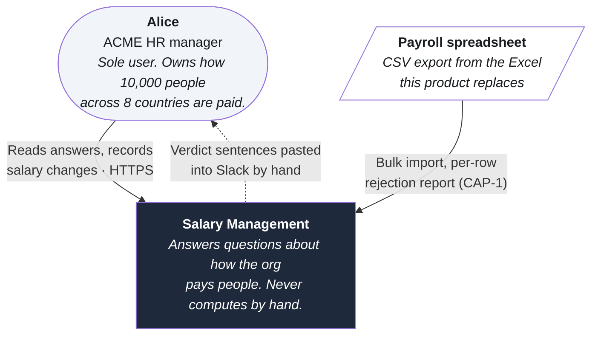
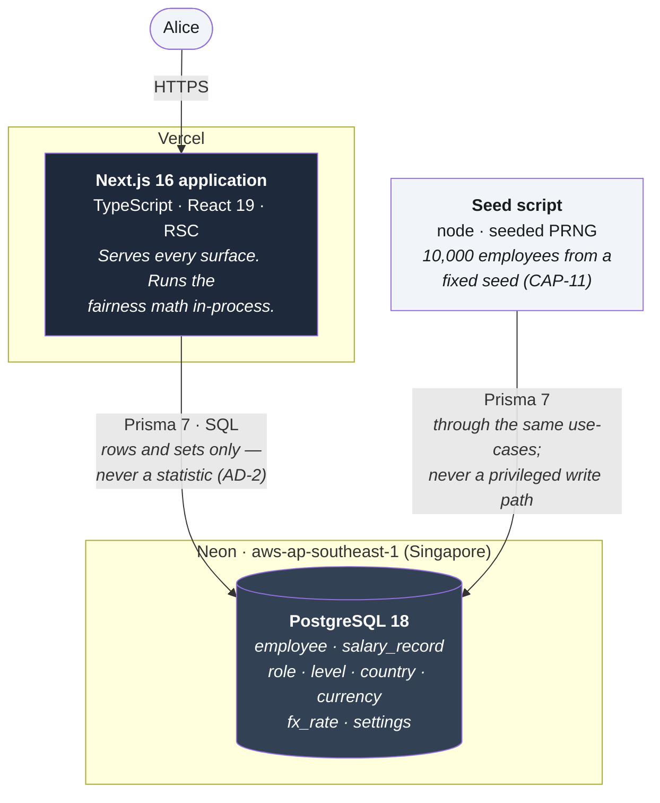
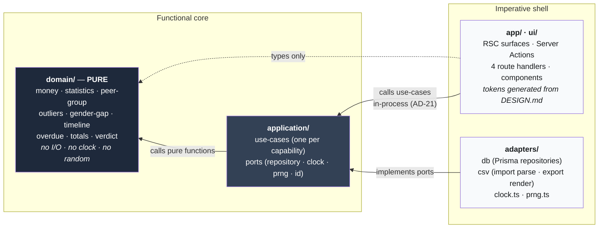
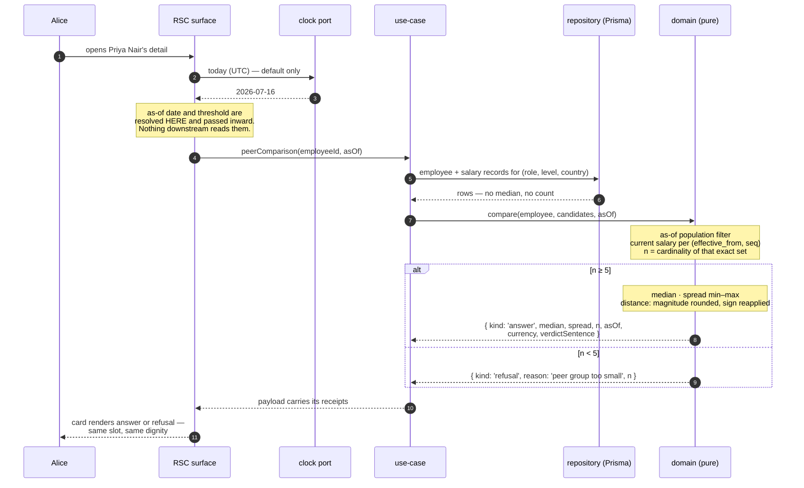
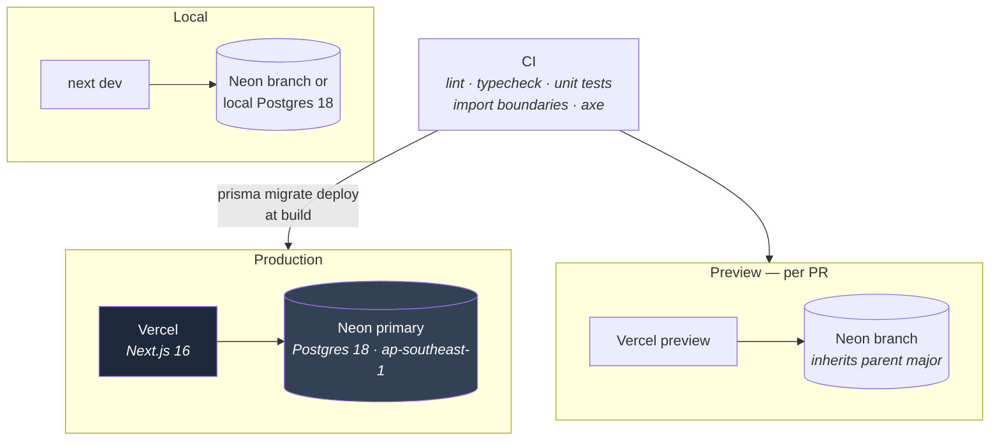

# C4 Model

Scannable version. Full text unchanged in [`C4-MODEL.md`](C4-MODEL.md).

Four zoom levels over the system [`ARCHITECTURE-SPINE.md`](ARCHITECTURE-SPINE.md) governs. The spine
is the contract; these are views. On conflict, the spine wins.

## Level 1 — System context

One user. One system. **No integrations.**

That emptiness is a finding, not an omission. This product replaces a spreadsheet and deliberately
connects to nothing: no payroll execution, no HRIS sync, no benchmark feed, no notifications. It never
reaches out. Findings wait for Alice to arrive.

The dotted line is the success criterion, and it is a human path **on purpose**. Alice copies a
sentence and pastes it herself. There is no integration to build, because standing behind the number
is the point.

## Level 2 — Containers

Three containers, and the count is itself a decision. A separate API tier was rejected: two
deployables, CORS, duplicated types, and a network hop, for a single-user tool over 10,000 rows.

The seed is a container rather than a script because **it writes through the same validation as the
import.** It is never a privileged path.

## Level 3 — Components inside the application

The level the paradigm lives at. One rule: **dependencies point inward, and the core is pure.**

Read the arrows: **nothing points out of `domain/`.** Enforced by a CI import-boundary lint rule, not
convention — because the failure it prevents (a component importing `PrismaClient`, a use-case calling
`new Date()`) compiles cleanly and passes review.

`clock.ts` is the **only `Date.now()` in the codebase.** Everything else receives the as-of date as a
required argument. That is what makes "the same question asked twice returns the same answer" a
structural property rather than a good intention.

## Level 4 — How one answer is computed

The peer-comparison card, traced end to end. Every other computed surface follows the same path.

Three properties fall out of this shape. Each maps to a promise made to Alice.

1. **The refusal is a return value, not an exception.** It travels the same path as an answer and
   lands in the same layout slot. An exception would route it to an error style and break the wager at
   the architecture level.
2. **The receipts cannot be separated from the number.** Group definition, `n`, as-of date, currency,
   and verdict sentence arrive as one object. A caption composed independently in a component could
   drift from the figure above it. This one cannot — and it is why copy-answer and the card are
   guaranteed to say the same thing.
3. **Nothing below the boundary can read a clock.** The as-of date enters once, at the top, as a
   default. Wind it back and every figure recomputes to what it was — not approximately, exactly.

## Deployment

Postgres major is pinned to 18 in all three environments. A Neon branch inherits its parent's major,
and local must match — or a query behaves differently in the one place nobody looks.

No staging tier: one user, no real data, no auth. **Seeding is never a deploy side effect.** It is an
explicit command, always.
